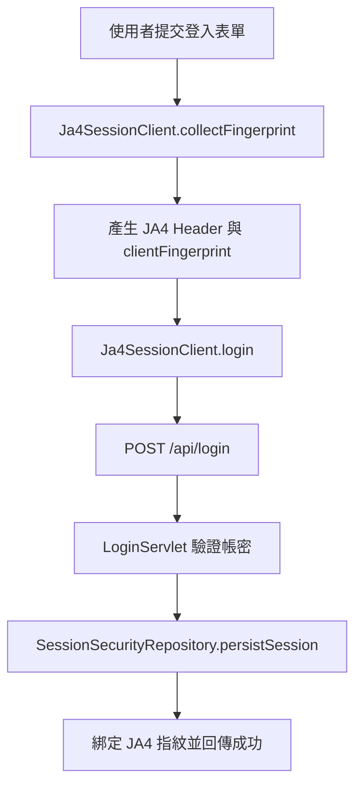
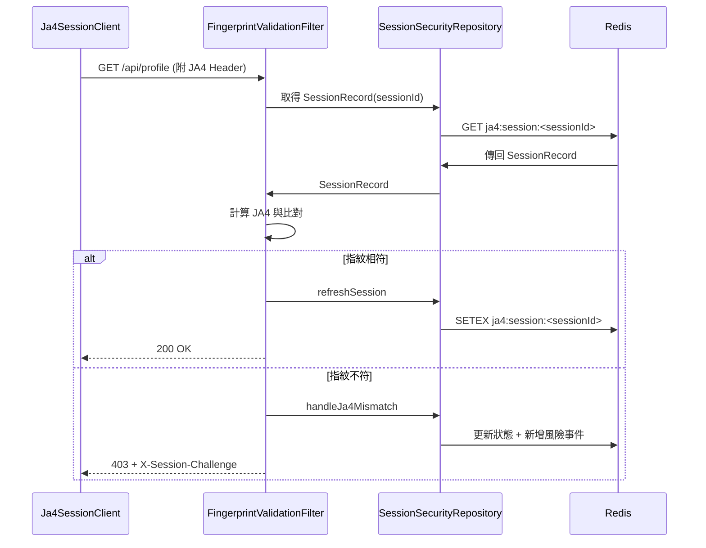
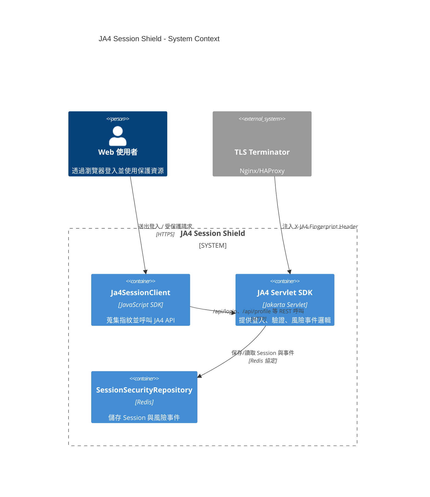

# JA4 Session SDK 使用指南

此文件說明如何在新專案中重用本範例的前端與後端元件。SDK 拆成兩個部分：

1. **前端模組**：`sdk/frontend/ja4-session-sdk.js`
2. **後端模組**：`Ja4SessionSdk`（由 Maven 產出的 `session-ja4-sample-1.0.0-sdk.jar`）

## 1. 前端元件

### 1.1 檔案位置

- `sdk/frontend/ja4-session-sdk.js` – 採用 ES Module 形式，可直接匯入到現代瀏覽器或打包工具（Vite/Webpack/Rollup）。

### 1.2 功能

`Ja4SessionClient` 會：
- 收集 Canvas/WebGL、UA、時區等裝置信號。
- 自動產生可復用的 client fingerprint 與模擬 JA4 Header。
- 封裝 `login`、`getProfile`、`logout` 等 API 呼叫，並處理 Cookie/指紋 Header。

### 1.3 基本使用方法

```html
<script type="module">
  import { Ja4SessionClient } from './sdk/frontend/ja4-session-sdk.js';

  const client = new Ja4SessionClient({ baseUrl: 'https://your-app.example.com/session-ja4' });

  async function login() {
    await client.collectFingerprint();
    const result = await client.login('admin', 'admin123');
    console.log('login result', result);
  }

  document.getElementById('loginBtn').addEventListener('click', login);
</script>
```

#### 主要 API

| 方法 | 說明 |
| ---- | ---- |
| `collectFingerprint()` | 蒐集訊號並產生 `hash`、`signals`。需在初次呼叫 API 前執行。 |
| `getFingerprint()` | 取得最近一次蒐集到的 `{ hash, signals }`。 |
| `setJa4Header(value)` / `getJa4Header()` | 讀寫模擬的 JA4 Header 值。 |
| `login(username, password, overrides)` | `POST /api/login`，自動帶入 fingerprint 與 signals。 |
| `getProfile()` | `GET /api/profile`。 |
| `logout()` | `POST /api/logout`。 |
| `requestWithFingerprint(path, init)` | 允許呼叫自訂 API，同時注入 JA4 Header 與 Cookie。 |

> Persistent ID 只存放在 `sessionStorage` 的雜湊值，關閉頁籤後會重新產生，降低被複製的風險。

## 2. 後端元件

### 2.1 建置與取得 JAR

1. 在專案根目錄執行 `mvn clean package`。
2. Maven 會產生：
   - `target/session-ja4-sample.war`（範例應用）
   - `target/session-ja4-sample-1.0.0-sdk.jar`（後端 SDK，classifier = `sdk`）
3. 可透過 `mvn install` 將 JAR 安裝到本機 Maven repository 供其他專案引用。

**POM 依賴範例：**
```xml
<dependency>
    <groupId>com.example</groupId>
    <artifactId>session-ja4-sample</artifactId>
    <version>1.0.0</version>
    <classifier>sdk</classifier>
</dependency>
```

### 2.2 提供的類別

| 類別 | 說明 |
| ---- | ---- |
| `com.example.session.sdk.Ja4SessionSdk` | 透過 `install(ServletContext, Ja4SessionSdkOptions)` 快速註冊 servlet/filter。 |
| `com.example.session.sdk.Ja4SessionSdkOptions` | 可設定 login/profile/logout 路徑與保護的 URL pattern。 |
| 其餘類別（`LoginServlet`、`FingerprintValidationFilter` 等）位於 `com.example.session` 包，可直接擴充或覆寫。 |

### 2.3 在 Servlet 專案中註冊

```java
import com.example.session.sdk.Ja4SessionSdk;
import com.example.session.sdk.Ja4SessionSdkOptions;
import jakarta.servlet.ServletContextEvent;
import jakarta.servlet.ServletContextListener;

public class Ja4Bootstrap implements ServletContextListener {
    @Override
    public void contextInitialized(ServletContextEvent sce) {
        Ja4SessionSdkOptions options = new Ja4SessionSdkOptions()
                .setLoginPath("/security/login")
                .setProfilePath("/security/profile")
                .setLogoutPath("/security/logout")
                .setProtectedPattern("/security/*");

        Ja4SessionSdk.install(sce.getServletContext(), options);
    }
}
```

於 `web.xml` 註冊 `Ja4Bootstrap` 或使用 `@WebListener` 皆可。`FingerprintValidationFilter` 會自動讀取 context attribute，避免硬編路徑。

### 2.4 Redis 與環境參數

- SDK 預設使用容器環境變數：`REDIS_HOST`、`REDIS_PORT`、`REDIS_PASSWORD`。
- 若 Redis 不可用，功能會自動降級為記憶體模式（僅針對當次 Session）。
- `SessionSecurityRepository` 會在 Redis 中建立：
  - `ja4:session:<sessionId>`：綁定 JA4 的 Session 資料
  - `ja4:risk-events`：風險事件列表（JA4 mismatch、IP/UA 變更、Session 終止）

### 2.5 常見擴充點

1. **挑戰流程**：收到 `X-Session-Challenge: VERIFY_JA4` 時，可於前端導向第二因素驗證頁面，完成後重新登入。
2. **事件匯出**：自訂 `SessionSecurityRepository.recordEvent`，將事件推送到 SIEM/Kafka。
3. **自訂儲存層**：實作自家 `SessionSecurityRepository` 版本或包覆 Redis Manager。

## 3. 完整串接流程

1. 在新專案中加入 SDK JAR 依賴並於 `ServletContextListener` 呼叫 `Ja4SessionSdk.install(...)`。
2. 前端載入 `ja4-session-sdk.js`，在登入/保護 API 前呼叫 `collectFingerprint()`，並透過 `login/getProfile/logout` 封裝函式發送請求。
3. 上游 TLS terminator 計算 JA4 並注入 `X-JA4-Fingerprint`；若尚未支援，可暫時使用 SDK 產生的模擬值做端對端測試。
4. 監控 Redis `ja4:risk-events`，以利 SOC 追蹤 JA4 mismatch、IP/UA 異常等事件。

## 4. 範例專案

- `src/main/webapp/test-client.html` 使用前端 SDK 實作介面，可作為整合範例。
- Docker Compose (`docker-compose.yml`) 可快速啟動 Tomcat + Redis 環境，用來驗證 SDK 行為。

如需進一步客製（整合 Spring Boot、傳送事件到 ELK 等），可在此 SDK 基礎上擴充對應的 Servlet/Filter 或改寫 `SessionSecurityRepository`。歡迎在 CI 環境執行 `mvn test` / `mvn package` 確保 jar 與 war 同步更新。

## 5. Mermaid 圖示

### 5.1 登入驗證流程圖


### 5.2 指紋比對時序圖


### 5.3 C4 架構圖

