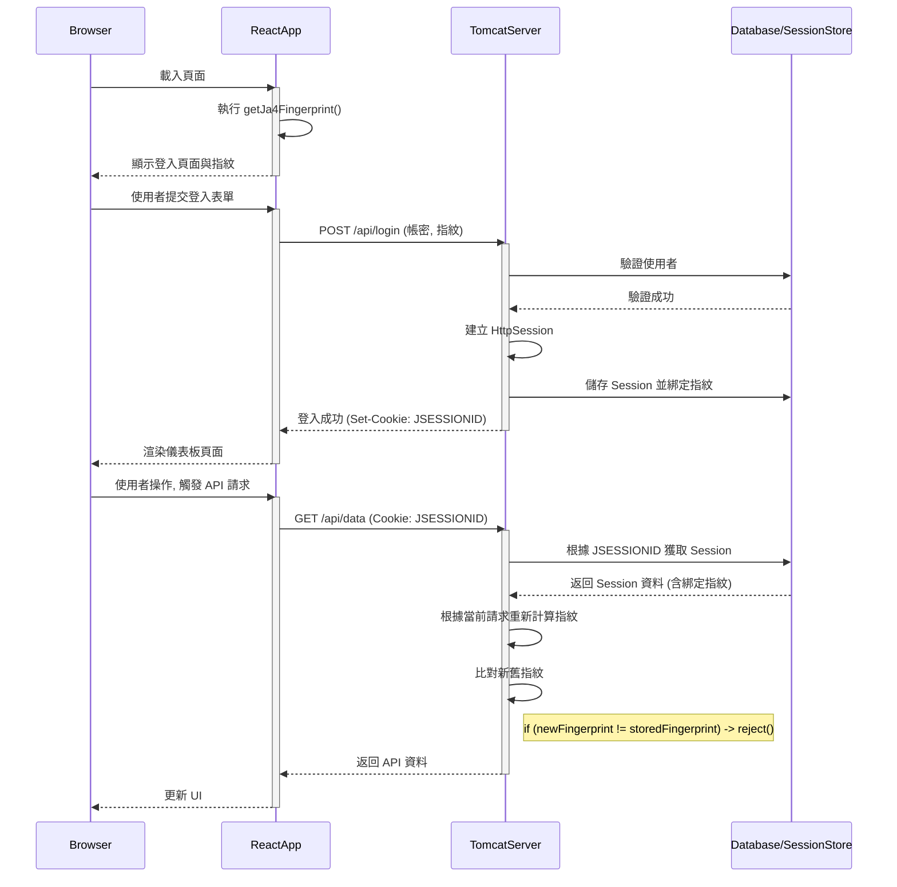

# JA4 Session Shield 技術架構與 Tomcat 實現指南

本文檔旨在詳細說明 "JA4 Session Shield" 專案中所演示的客戶端指紋綁定 Session 的安全機制。內容涵蓋了當前前端的實現細節、後端應有的處理邏輯，並提供了在 Java/Tomcat 環境中實現此機制的具體指導。

## 1. 核心目標

防止 **Session 劫持 (Session Hijacking)**。傳統上，攻擊者如果竊取到使用者的 `sessionId` (例如從 Cookie 中)，就可以冒充該使用者向伺服器發送請求。我們的目標是將每個 Session 與其建立時的客戶端指紋（JA4 指紋）進行強綁定。即使 `sessionId` 被盜，由於攻擊者的客戶端指紋與合法使用者的不同，伺服器也能識別並拒絕該非法請求。

## 2. 前端處理流程 (以當前 React App 為例)

前端的主要職責是**生成一個能高度代表當前客戶端環境的唯一指紋**，並在登入時將其發送給後端。

在目前的實作中，這個指紋是**模擬**的，但其組合的參數旨在達到與真實 JA4 相似的獨特性。

### 指紋的組成

指紋生成的核心邏輯位於 `services/authService.ts` 中的 `getJa4Fingerprint` 函數。它收集了以下幾類資訊：

1.  **標準瀏覽器屬性**:
    *   `userAgent`: 瀏覽器及作業系統資訊。
    *   `language`: 瀏覽器語言。
    *   `platform`: 作業系統平台 (例如 `Win32`, `MacIntel`)。
    *   `resolution`: 螢幕解析度。
    *   `colorDepth`: 螢幕顏色深度。
    *   `timezoneOffset`: 時區偏移量。

2.  **持久化客戶端 ID (`persistentId`)**:
    *   為了區分設定完全相同的兩台機器，我們在 `localStorage` 中儲存一個 `crypto.randomUUID()`。這確保了同一個瀏覽器在多次訪問時具有穩定的標識符，但不同瀏覽器實例（即使在同一台機器上）會有不同的 ID。

3.  **動態畫布指紋 (`canvasId`)**:
    *   這是**防止指紋被輕易複製和轉移的關鍵安全層**。通過 `getCanvasFingerprint` 函數，我們在一個不可見的 `<canvas>` 元素上繪製圖形和文字。
    *   由於不同設備的 GPU、驅動程式、字體渲染引擎存在微小差異，生成的圖像數據會有不同，從而產生一個與硬體和軟體堆疊強相關的哈希值。
    *   即使攻擊者複製了 `localStorage` 中的 `persistentId`，他們也無法在自己的機器上生成相同的 `canvasId`。

### 指紋的生成與發送

整個流程如下：

-   **`App.tsx`** 在組件掛載時調用 `fetchFingerprint`，後者執行 `getJa4Fingerprint()`。
-   **`getJa4Fingerprint()`** 收集上述所有參數，將它們合併成一個字串。
-   使用 `createBrowserHash()` 函數對該字串進行哈希運算，模擬出一個看起來像 JA4 的 `dynamicJa4` 指紋。
-   當使用者在 **`LoginPage.tsx`** 點擊登入時，`handleLogin` 函數會將使用者名稱、密碼以及這個生成好的指紋一起透過 `login()` 服務發送出去。

```javascript
// App.tsx -> handleLogin
const handleLogin = async (username, password) => {
    // ...
    // fingerprintData.fingerprint 就是我們在前端生成的指紋
    const loggedInUser = await login(username, password, fingerprintData.fingerprint);
    // ...
};
```

---

## 3. 後端處理流程 (概念與設計)

後端是安全機制的核心執行者。它負責**驗證**、**儲存**和**比對**指紋。

### 登入階段

1.  **接收請求**: 後端 API (例如 `/api/login`) 接收來自前端的 POST 請求，其中包含 `username`, `password` 和前端生成的 `fingerprint`。
2.  **使用者認證**: 驗證使用者名稱和密碼是否正確。
3.  **建立 Session**: 認證成功後，為該使用者建立一個新的 Session，並產生 `sessionId`。
4.  **綁定指紋**: **將前端發送過來的 `fingerprint` 儲存為該 Session 的一個屬性**。例如，在 Redis 或資料庫中，Session 物件可能看起來像這樣：
    ```json
    {
      "sessionId": "sess_abc-123",
      "userId": "admin",
      "expiresAt": "...",
      "boundFingerprint": "t13d1516h2_a9b8c7d6e5f4_1a2b3c4d5e6f" 
    }
    ```
5.  **返回結果**: 將 `sessionId` 透過 `Set-Cookie` header 返回給客戶端。

### 後續請求驗證階段

對於每一個需要驗證 Session 的後續請求 (例如 `/api/dashboard`):

1.  **接收請求**: 客戶端在請求的 Cookie 中會自動帶上 `sessionId`。
2.  **獲取 Session**: 後端根據 `sessionId` 查找對應的 Session 資料。如果找不到，則拒絕請求。
3.  **重新生成指紋**: **後端需要根據當前請求的特徵，重新計算一次客戶端指紋。**
4.  **比對指紋**: 將**重新計算出的指紋**與 Session 中**儲存的 `boundFingerprint`** 進行比較。
5.  **決策**:
    *   如果兩個指紋**匹配**，則證明請求來自合法的客戶端，處理該請求。
    *   如果兩個指紋**不匹配**，則判定為 Session 劫持攻擊，應立即**銷毀該 Session** 並返回 401/403 錯誤。

---

## 4. 流程圖與時序圖

### 流程圖 (Flowchart)

```mermaid
graph TD
    subgraph "Login Phase"
        A[Client: 載入 App] --> B{Frontend: getJa4Fingerprint()};
        B --> C[Frontend: 收集瀏覽器/Canvas/LocalStorage 參數];
        C --> D[Frontend: 生成模擬 JA4 指紋];
        E[Client: 輸入帳號密碼並提交] --> F{Frontend: 發送登入請求 (含指紋)};
        F --> G[Backend: 接收請求];
        G --> H{Backend: 驗證帳密};
        H -- 成功 --> I[Backend: 建立 Session];
        I --> J[Backend: 將前端指紋綁定到 Session];
        J --> K[Backend: 返回 Session Cookie];
        H -- 失敗 --> L[Backend: 返回錯誤];
    end

    subgraph "Subsequent Request Phase"
        M[Client: 發起 API 請求 (攜帶 Session Cookie)] --> N[Backend: 接收請求];
        N --> O{Backend: 根據 Cookie 找到 Session};
        O -- 找不到 --> P[Backend: 拒絕請求 (401)];
        O -- 找到 --> Q[Backend: 從 Session 取出綁定的指紋];
        Q --> R[Backend: 根據當前請求重新計算指紋];
        R --> S{Backend: 比對兩個指紋};
        S -- 不匹配 --> T[Backend: 判定為劫持, 銷毀 Session, 拒絕請求 (403)];
        S -- 匹配 --> U[Backend: 處理請求, 返回數據];
    end
```

### 時序圖 (Sequence Diagram)



---

## 5. 在 Tomcat 環境中的實現對應

將此機制移植到 Tomcat/Java 環境，前端的邏輯基本不變，核心工作在於後端的實現。

### 前端部分

-   **部署**: React 應用程式 (執行 `npm run build` 後的 `dist` 目錄) 可以作為靜態資源部署在 Tomcat 的 `webapp` 目錄下，或由 Nginx/Apache 等 Web Server 提供服務。
-   **API 端點**: `services/authService.ts` 中的 `fetch` 請求需要將 URL 從模擬的 Promise 指向真實的 Tomcat 後端 API 端點，例如 `fetch('/api/login', ...)`。

### 後端部分 (Java Servlet/Filter)

後端的實現可以分為兩個核心組件：一個處理登入的 `Servlet` 和一個驗證後續請求的 `Filter`。

#### 1. 登入 Servlet (`LoginServlet.java`)

這個 Servlet 負責處理 `/api/login` 請求。

```java
@WebServlet("/api/login")
public class LoginServlet extends HttpServlet {
    protected void doPost(HttpServletRequest request, HttpServletResponse response) throws ServletException, IOException {
        // 1. 解析請求 Body, 獲取 username, password, 和 clientFingerprint
        //    (需要使用像 GSON 或 Jackson 這樣的庫來解析 JSON)
        LoginRequest loginReq = new Gson().fromJson(request.getReader(), LoginRequest.class);

        // 2. 驗證使用者 (連接資料庫等)
        boolean isAuthenticated = YourAuthService.authenticate(loginReq.getUsername(), loginReq.getPassword());

        if (isAuthenticated) {
            // 3. 建立 Session
            HttpSession session = request.getSession(true); // true 表示如果不存在就建立一個新的

            // 4. 將前端傳來的指紋綁定到 Session
            session.setAttribute("boundFingerprint", loginReq.getClientFingerprint());
            session.setAttribute("user", loginReq.getUsername());

            // 5. 返回成功響應
            response.setStatus(HttpServletResponse.SC_OK);
            response.getWriter().write("{\"status\": \"success\"}");
        } else {
            // 認證失敗
            response.setStatus(HttpServletResponse.SC_UNAUTHORIZED);
            response.getWriter().write("{\"error\": \"Invalid credentials\"}");
        }
    }
}
// 需要一個輔助類來映射 JSON
class LoginRequest {
    private String username;
    private String password;
    private String clientFingerprint;
    // Getters...
}
```

#### 2. 指紋驗證 Filter (`FingerprintValidationFilter.java`)

這是安全機制的核心。這個 Filter 會攔截所有需要保護的資源請求（例如 `/api/*`，但不包含 `/api/login`）。

```java
@WebFilter("/api/*")
public class FingerprintValidationFilter implements Filter {

    public void doFilter(ServletRequest req, ServletResponse res, FilterChain chain) throws IOException, ServletException {
        HttpServletRequest request = (HttpServletRequest) req;
        HttpServletResponse response = (HttpServletResponse) res;

        // 不過濾登入請求自身
        if ("/api/login".equals(request.getRequestURI())) {
            chain.doFilter(request, response);
            return;
        }

        HttpSession session = request.getSession(false); // false 表示不自動建立新 Session

        if (session == null) {
            // 沒有 Session, 直接拒絕
            response.sendError(HttpServletResponse.SC_UNAUTHORIZED, "No active session.");
            return;
        }

        // 從 Session 中獲取之前綁定的指紋
        String storedFingerprint = (String) session.getAttribute("boundFingerprint");

        // 重新計算當前請求的指紋 (這是關鍵且複雜的一步)
        // 您需要一個服務來從 request 中提取 User-Agent 等 header, 
        // 但 Canvas 指紋和 LocalStorage ID 無法在後端直接獲取。
        // 這意味著後端驗證的指紋必須是基於請求本身可用的資訊。
        //
        // *** 最佳實踐：真實 JA4 指紋 ***
        // 在生產環境中，我們不再使用前端模擬的指紋進行比對。
        // 而是由伺服器前端的負載均衡器或反向代理 (如 Nginx, HAProxy, F5) 
        // 從 TLS Handshake 中計算出真實的 JA4 指紋，並透過一個 HTTP Header (例如 X-JA4-Fingerprint) 傳遞給 Tomcat。
        // 這樣後端只需讀取 header 即可。
        
        String currentRequestFingerprint = request.getHeader("X-JA4-Fingerprint");

        if (currentRequestFingerprint != null && currentRequestFingerprint.equals(storedFingerprint)) {
            // 指紋匹配，放行請求
            chain.doFilter(request, response);
        } else {
            // 指紋不匹配，銷毀 Session 並拒絕請求
            session.invalidate();
            response.sendError(HttpServletResponse.SC_FORBIDDEN, "Fingerprint mismatch. Session terminated.");
        }
    }

    // init() and destroy() methods...
}
```

### 總結 Tomcat 實現的要點

1.  **前端保持不變**: 只需修改 API URL。
2.  **後端實現**: 使用一個 `Servlet` 處理登入和指紋綁定，使用一個 `Filter` 攔截和驗證後續請求。
3.  **指紋的來源是關鍵**:
    *   **登入時**: 應該信任一個由**反向代理**計算並傳入 Header 的**真實 JA4 指紋**，而不是前端模擬的指紋。前端的複雜指紋生成更多是作為一個輔助性的、加強客戶端識別的信號。一個更強大的策略是後端在登入時同時儲存代理傳來的 JA4 指紋和前端傳來的 Canvas 指紋，後續驗證時進行雙重檢查。
    *   **驗證時**: 同樣依賴反向代理為每個請求計算的 JA4 指紋 Header。
4.  **依賴**: 需要一個能夠計算 JA4 指紋並將其注入 HTTP Header 的網路基礎設施組件（Nginx/HAProxy 等）。這是將此方案投入生產的**硬性要求**。
